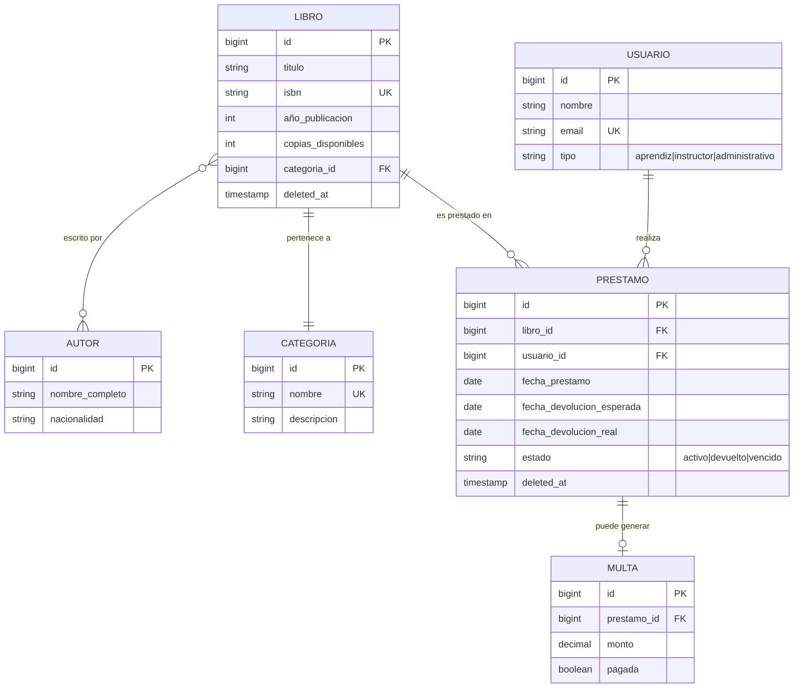

# Tutorial — Modelado de BD: Biblioteca CIES

> Este es el **dominio guiado** que usaremos en clase para aprender el patrón.
> En tu **proyecto formativo** aplicarás los mismos conceptos a TU propio dominio.

## Contexto

El **CIES (Centro de Innovación, Educación y Servicios)** del SENA Regional Norte de Santander necesita digitalizar la gestión de su biblioteca interna. Actualmente todo está en una hoja de Excel y los préstamos se registran en cuaderno.

### Requisitos funcionales (resumidos)

- **RF-01**: Registrar libros con su información bibliográfica
- **RF-02**: Asociar uno o más autores a cada libro
- **RF-03**: Categorizar libros por área de conocimiento
- **RF-04**: Registrar usuarios (aprendices, instructores) que pueden tomar préstamos
- **RF-05**: Registrar préstamos con fecha de salida y fecha de devolución
- **RF-06**: Marcar préstamos como devueltos (sin perder histórico)
- **RF-07**: Calcular multas por entrega tardía
- **RF-08**: Generar reportes de libros más prestados

## Modelo conceptual

## Decisiones de diseño

### ¿Por qué tabla pivote `libro_autor`?

Un libro puede tener varios autores; un autor puede haber escrito varios libros. Eso es **muchos a muchos (M:N)**, que en SQL relacional se resuelve con tabla intermedia.

### ¿Por qué `softDeletes` en `prestamos` pero no en `categorias`?

- **`prestamos`**: necesitamos histórico permanente (auditoría, reportes históricos). Borrar físicamente sería perder datos.
- **`categorias`**: si borramos una categoría, los libros se reasignarían. Aquí no necesitamos histórico de "categorías que existieron".

### ¿Por qué `enum` en `prestamos.estado` vs tabla aparte?

Para 3 estados estables (`activo`, `devuelto`, `vencido`) un enum (vía `string` con check) es más simple que crear tabla `estados_prestamo`. **Si el negocio tuviera 20 estados con atributos extra** (como SLA, color de UI, etc.), ahí sí justificaría tabla aparte.

### ¿Por qué `multa` es tabla aparte y no columna en `prestamo`?

- Un préstamo puede no generar multa (entregado a tiempo).
- Una multa tiene atributos propios (monto, fecha de pago, comprobante).
- Permite extender en el futuro a multas por daño de libro, no solo por demora.

## Restricciones de integridad

| Tabla | Restricción | Razón |
|-------|-------------|-------|
| `libros` | `isbn UNIQUE` | No puede haber dos libros con mismo ISBN |
| `categorias` | `nombre UNIQUE` | Evitar duplicados |
| `usuarios` | `email UNIQUE` | Login único |
| `prestamos` | `fecha_devolucion_esperada > fecha_prestamo` | Regla de negocio |
| `multas` | `monto >= 0` | Sentido común |
| FK `libros.categoria_id → categorias.id` | `ON DELETE RESTRICT` | No borrar categoría con libros |
| FK `prestamos.libro_id → libros.id` | `ON DELETE RESTRICT` | No borrar libro con préstamos activos |

## Esquema de seguridad

| Rol | Permisos |
|-----|----------|
| **bibliotecario** | CRUD en libros/autores/categorías; gestionar préstamos |
| **usuario** | Ver libros disponibles; ver sus propios préstamos |
| **administrador** | Todo lo anterior + gestión de usuarios + reportes |

### Información sensible

- `usuarios.email`: único pero no encriptado (necesario para búsqueda)
- `usuarios.password` (si se agrega login): **bcrypt** vía `Hash::make`
- `multas.monto`: solo visible para bibliotecario y administrador

### Auditoría

- Timestamps en todas las tablas (`created_at`, `updated_at`)
- Soft deletes en `prestamos` y `libros` (preservan histórico)
- Tabla `multas` no se borra nunca (compliance financiero interno)

## ¿Cómo aplicas esto a TU proyecto?

1. **Identifica las entidades principales** de tu dominio (≥ 5)
2. **Encuentra al menos 1 relación M:N** (siempre la hay si lo piensas)
3. **Encuentra las tablas transaccionales** (las que registran "eventos" — pedidos, asistencias, transferencias) → ahí va `softDeletes`
4. **Justifica las restricciones** desde reglas de negocio reales, no copies las del tutorial
5. **No copies el ER de biblioteca** — los tests detectan eso revisando los nombres de tablas
